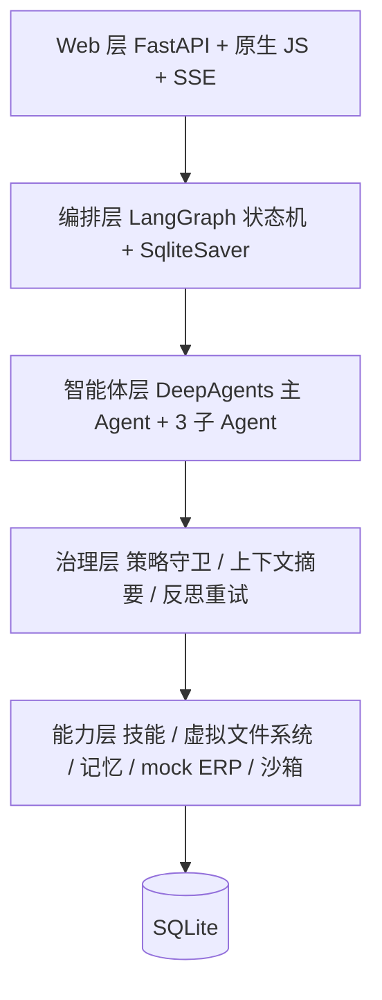

# 耗材采购自动化 Agent 系统

基于 DeepAgents 的多 Agent 采购流程自动化系统：主 Agent 委派三类子 Agent，完成「需求输入 → 资质核验 → 比价分析 → 订单审批 → 订单生成」的完整闭环，并提供本地 Web 界面实时观察委派过程、审批拦截与异常重试。

需求范围见 [PRD.md](PRD.md)，实施计划见 [plan.md](plan.md)，技术方案见 [docs/architecture.md](docs/architecture.md)，关键决策见 [docs/decision-log.md](docs/decision-log.md)。

## 架构



设计要点：

- **状态机在外层作为唯一状态源**，让长任务可中断、可恢复、可在页面上渲染。
- **子 Agent 通过 DeepAgents 框架的 `task` 工具被真实委派**：主 Agent 运行在 `create_deep_agent` 构造的图上，由模型决定把工作交给哪个子 Agent；事件流里的 `delegation_result` 标明本次委派是 `framework` 还是 `fallback`（模型未委派时降级为直接执行，并写明原因，绝不伪装）。
- **业务判定是确定性纯函数**（资质筛选、成本计算、阈值判断），模型只负责"决定调用哪个工具"与需求解析，不负责算钱和判资质。
- **缺信息会停下来问，并且能接着跑**：需求缺物料或数量时任务进入等待澄清状态，用户在页面补充后从解析阶段续跑（不是重建任务）；物料名称支持主数据别名，例如"办公用纸"可匹配到 `A4 纸`。

## 快速开始

```bash
# 1. 创建虚拟环境并安装依赖
python -m venv .venv
.venv\Scripts\python.exe -m pip install -e ".[dev]"

# 2. 配置模型（真实运行时需要）
copy .env.example .env
# 编辑 .env，填入 DEEPSEEK_API_KEY

# 3. 启动 Web 服务
.venv\Scripts\python.exe -m uvicorn procurement_agent.web.app:create_app --factory --port 8000
```

打开 http://127.0.0.1:8000 即可看到任务看板页。

**模型模式是自动判断的**：未配置 `DEEPSEEK_API_KEY` 时，应用会自动切换到内置离线解析器（正则规则，不联网），
页面顶部显示橙色"离线演示模式"横幅，全流程仍可完整跑通（不联网）。配置 key 后重启即用真实
模型，横幅消失。想强制离线可用 `.venv\Scripts\python.exe -m uvicorn procurement_agent.web.app:create_demo_app --factory --port 8000`。

评测与测试全程离线运行，不需要任何 API key。

## 目录结构

```
config/            agents.yaml（Agent 定义）、procurement.yaml（阈值等业务参数）
skills/            四类领域技能，SKILL.md + frontmatter，按需加载
src/procurement_agent/
  agents/          主 Agent 编排、三个子 Agent、模型工厂、离线模型
  state/           任务状态机、事件存储、LangGraph 流程图
  sandbox/         策略引擎（层一）与受限执行器（层二）
  middleware/      上下文摘要、策略守卫、反思重试
  memory/          采购偏好与供应商历史
  erp/             mock ERP 仓储与故障注入
  web/             FastAPI 接口、SSE 推送与四个页面
  eval/            30 条固定用例集与评测运行器
tests/             144 项测试
docs/              架构、安全、决策记录、演示脚本
```

## 演示路径

1. 任务看板页点「填入示例需求」→ 提交，进入采购执行页。
2. 执行页观察：左侧技能标签从「仅描述」逐个变为「已加载全文」；中间任务树展开三类子 Agent 与其工具调用；右侧时间线实时滚动，中间件动作单独标记。
3. 打开数据台，开启「让供应商 B 资质过期」，回到看板重新提交，观察系统淘汰该供应商并在比价结论中说明改选理由。
4. 提交 `采购 3000 箱 A4 纸`，金额超阈值触发审批卡片，现场批准或驳回（驳回会回退到比价阶段重跑）。
5. 打开评测页，点「运行评测」，查看指标与失败用例。

详细分镜与讲解要点见 [docs/demo-script.md](docs/demo-script.md)。

**要自己动手操作，看 [docs/operation-guide.md](docs/operation-guide.md)**：启动停止、四个页面能做什么、六个演示场景的具体操作、出错排查、面试追问速查。

## 评测

```bash
.venv\Scripts\python.exe -m procurement_agent.eval.runner --out eval_results/latest.json
```

30 条固定用例覆盖正常路径 12 条、单故障 15 条、组合故障 3 条；每条用例使用独立数据库，结果可复现。真实模型模式加 `--live`：

```bash
.venv\Scripts\python.exe -m procurement_agent.eval.runner --live --out eval_results/live_full.json
```

| 指标 | 离线确定性模式 | 真实模型模式 |
| --- | --- | --- |
| 用例总数 | 30 | 30 |
| 成功率 | 100%（30/30） | 100%（30/30） |
| 人工介入率 | 26.7% | 26.7% |
| 平均单任务耗时 | 约 0.95 s | 约 28.1 s |
| 框架委派 / 降级次数 | 90 / 0 | 90 / 0 |
| 每任务 token 总量 | 0（离线模型无用量，不造假） | 均值 57,863（中位数 58,378，最大 62,170） |
| 单次调用 token 峰值 | 由摘要中间件估算 | 均值 4,056，最大 4,274 |
| 上下文压缩率 | 87.3%（4670 → 592 token，12 段工具返回基准） | — |
| 自动化测试 | 197 项全部通过 | — |

另有一组高难度用例（模糊表述、物料别名、边界数量、供应商不足等）：

```bash
.venv\Scripts\python.exe -m procurement_agent.eval.runner --live \
  --cases src/procurement_agent/eval/cases_hard.yaml --out eval_results/hard_live.json
```

真实模型下 10/10 通过、人工介入率 30%、每任务约 4.5 万 token、24 次委派零降级。
这组用例不是为了刷高成功率，而是为了证明系统在模糊输入下会**停下来提问**而不是猜。

**口径说明（重要）：**

- 离线模式的数字用于验证流程编排、状态机、策略与治理逻辑的正确性与可复现性；真实模型模式的数字才代表端到端表现。两者不可混用陈述。
- 真实模型下单个任务约消耗 5.8 万 token、耗时约 28 秒，原因是每个任务会产生约 7 次模型调用（1 次需求解析 + 3 次委派 × 主 Agent 与子 Agent 各一次）。这是多 Agent 架构的真实开销，不是估算值——通过 LangChain 回调采集模型返回的 `usage_metadata` 得到。
- 离线耗时低于真实模型，仅因为它用规则解析器替代了模型调用，不代表生产性能。

## v1 范围

已实现：状态机与持久化审批中断、四类技能渐进式加载、三类子 Agent 委派、虚拟文件系统与路径逃逸防护、持久化记忆、上下文摘要、双层沙箱、反思重试、四个页面、可复现评测。

明确不做：真实 ERP 对接、容器级隔离、多租户与 SSO、支付/收货/入库/对账、寻源与招投标、技能热插拔、向量检索记忆、并发多任务、多模型路由、移动端适配、性能压测。详见 PRD 3.2。
